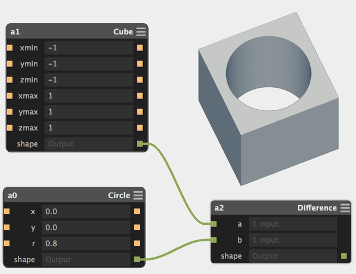

# [Antimony](http://www.mattkeeter.com/projects/antimony/)
By [Matt Keeter](http://www.mattkeeter.com)

> A computer-aided design (CAD) tool from a parallel universe in which CAD software evolved from Lisp machines rather than drafting tables.

    

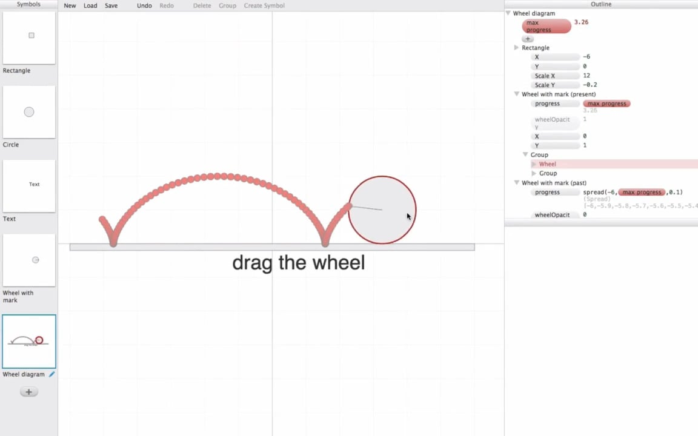

# [Apparatus](http://aprt.us)
By [Toby Schachman](https://twitter.com/mandy3284)

> A hybrid graphics editor and programming environment for creating interactive diagrams.

* [Strange Loop Talk](https://www.youtube.com/watch?v=i3Xack9ufYk)

    

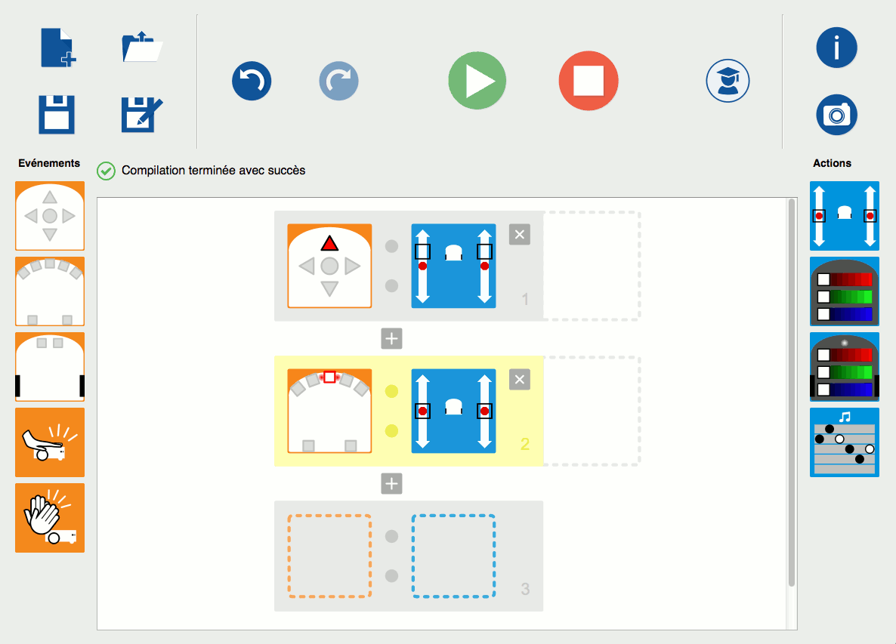

# [Aseba](https://github.com/aseba-community/aseba)

> A set of tools which allow novices to program robots easily and efficiently.

* While Aseba isn't a visual programming tool itself, it does [contain one](https://www.thymio.org/en:visualprogramming).
* Paper: [Visual Programming Language for Thymio II Robot](http://stephane.magnenat.net/publications/Visual%20Programming%20Language%20for%20Thymio%20II%20Robot%20-%20IDC%20-%202014.pdf)

    

# [Befunge](http://catseye.tc/article/Languages.md#befunge-93)
by Chris Pressey of [Cat's Eye Technologies](https://catseye.tc)

> Befunge is a stack-based, reflective, esoteric programming language. It differs from conventional languages in that programs are arranged on a two-dimensional grid.

This [blog post](https://dorianbrown.dev/befunge/) by Dorian Brown does a fantastic job of visualizing the execution of Befunge, and includes an interactive playground.

* [Esolangs](https://esolangs.org/wiki/Befunge-93)
* [Wikipedia](https://en.wikipedia.org/wiki/Befunge)

    

# [Blender](https://www.blender.org/)
Blender is an open-source 3D animation program with several visual programming tools.

 

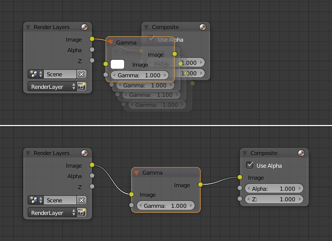

The [node editor](https://docs.blender.org/manual/en/latest/editors/node_editor/introduction.html) allows you to create materials (shaders), texture maps, and compositing flows. They're also used for [rendering](https://docs.blender.org/manual/en/latest/render/cycles/nodes/introduction.html).

 

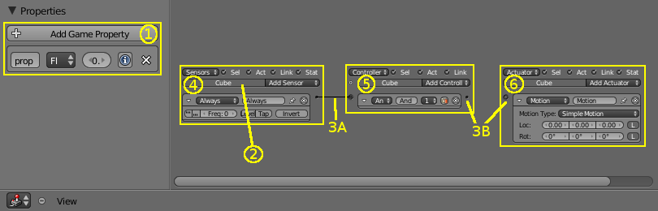

The [logic editor](https://docs.blender.org/manual/en/latest/editors/logic_editor.html) is used to set up game logic for Blender's built-in game engine. The interface seems like a slightly different take on patching, with a 3-step `sensor > controller > actuator` layout.

    

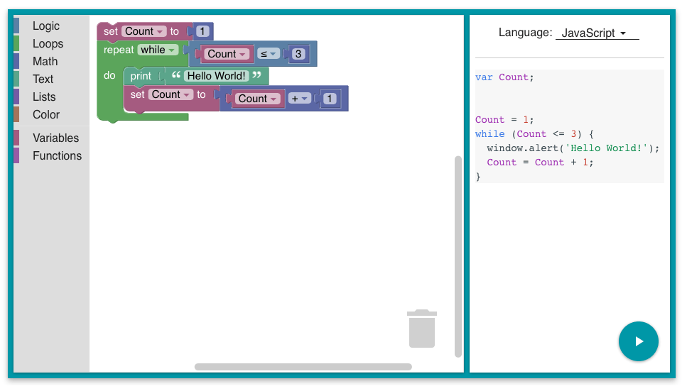

# [Blockly](https://developers.google.com/blockly/)
by Neil Fraser with Quynh Neutron, [Ellen Spertus](https://en.wikipedia.org/wiki/Ellen_Spertus), and Mark Friedman at Google.

A JavaScript library for building Scratch-like block-based visual programming editors. Block code can be transpiled into JavaScript, Python, PHP, Dart, or other languages. An outgrowth of the [App Inventor](https://en.wikipedia.org/wiki/App_Inventor_for_Android) project.

* [Interview with Neil Fraser](https://opensource.com/education/15/2/blockly-makes-easier-every-one-learn-code)
* [Wikipedia](https://en.wikipedia.org/wiki/Blockly)

    

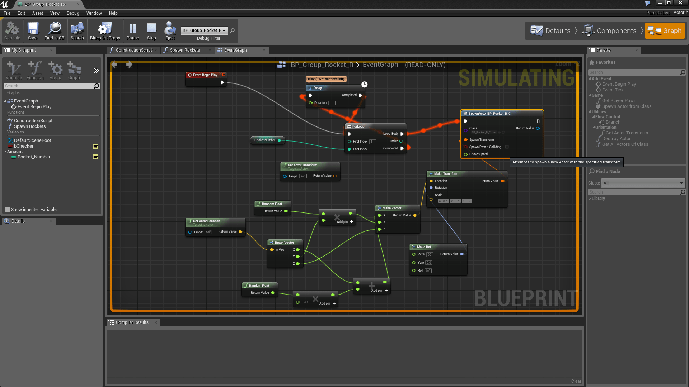

# [Blueprint](https://docs.unrealengine.com/en-us/Engine/Blueprints)

A scripting system built into the Unreal Engine.

* [Blueprints From Hell](https://blueprintsfromhell.tumblr.com) is a Tumblr collecting examples of large or messy Blueprint scripts.

    

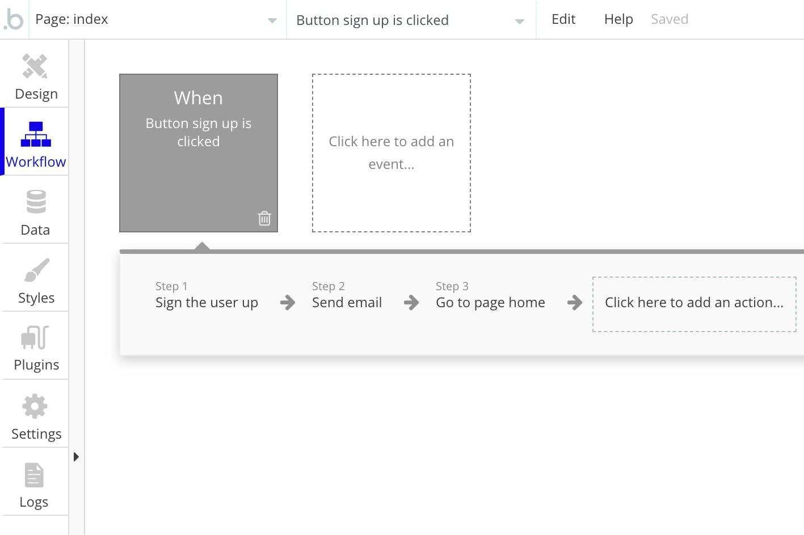

# [Bubble](https://bubble.is)

A drag-and-drop tool for creating web applications. There's a visual design mode that looks a bit like Keynote or iBooks Author, and a "Workflow" programming mode that seems similar to [IFTTT](#ifttt).

* Blog: [Creating a $100,000/mo Business That Helps People Learn to Code](https://www.indiehackers.com/businesses/bubble)
    * [HN Discussion](https://news.ycombinator.com/item?id=15681379)

    

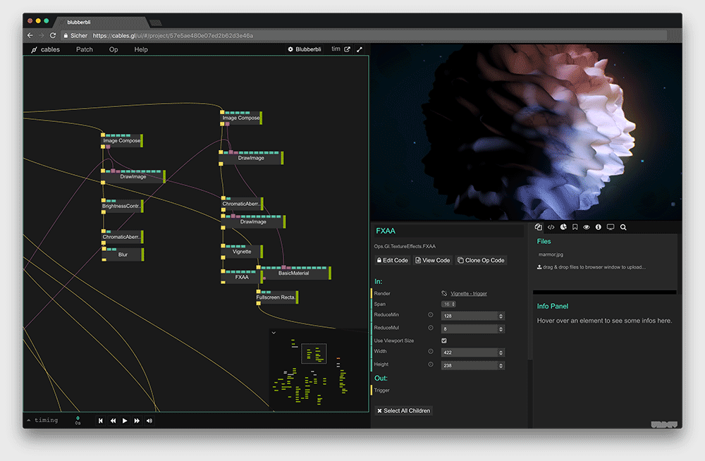

# [Cables](https://cables.gl)
by [Undev](https://undev.studio)

> Cables is your model kit for creating beautiful interactive content. With an easy to navigate interface and results in real time, it allows for fast prototyping and prompt adjustments.
> Working with cables is just as easy as creating cable spaghetti:
> You are provided with a given set of operators such as mathematical functions, shapes and materials.
> Connect these to each other by virtual cables to create the scene you have in mind.
> Easily export your piece of work at any time. Embed it into your website or use it for any kind of creative installation.

* Here's a nice short [tutorial video](https://www.youtube.com/watch?v=QXxgX2kS0TE) that shows some of the features, what the editor interface is like, etc.

    

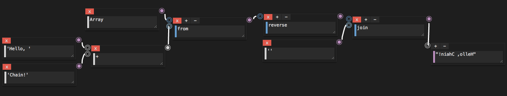

# [Chain](https://github.com/mimorisuzuko/chain)

> A New Visual Programming Environment to Build JavaScript By Linking Blocks.

Not particularly interesting on its own, but [Cochain](https://github.com/mimorisuzuko/chain/tree/feature/co) is cute.

    When I first read the word "coedit" I thought they meant the [dual](https://en.wikipedia.org/wiki/Dual_(category_theory)) of "edit" and got *very* excited, wondering what that could mean. Alas. Exercise for the reader! (Let me know what you come up with)

    

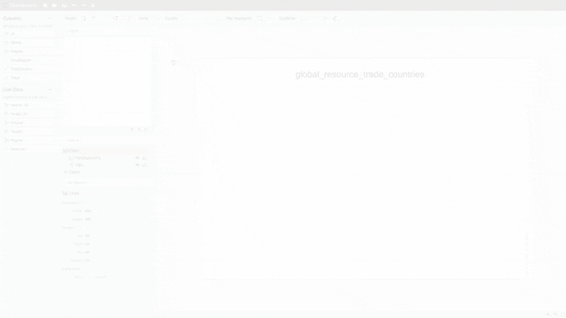

# [Charticulator](https://charticulator.com)

> Interactive Construction of Bespoke Chart Layouts

A project from Microsoft research for building data visualizations using direct manipulation of graphics, very similar to (and presumably inspired by) Bret Victor's [Drawing Dynamic Visualizations](reflections.md#drawing-dynamic-visualizations)

    

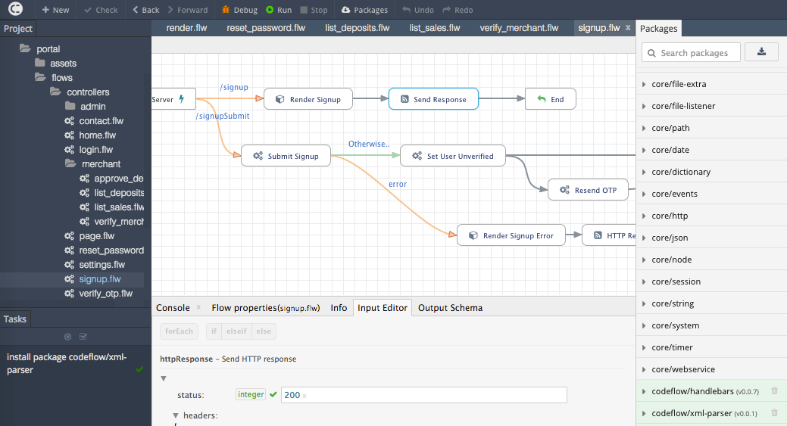

# [CodeFlow](http://codeflow.co)

A VPL editor that appears to be geared toward building NodeJS server apps.

Created by [Murukesh Sadasivan](https://twitter.com/murukeshs)

    

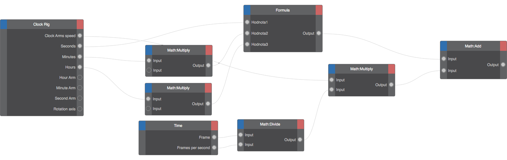

# [Cinema 4D Xpresso](https://help.maxon.net/us/#5829)

A rudimentary nodes-and-wires patcher used for procedural animation and rule-based particle effects in [Cinema 4D](https://en.wikipedia.org/wiki/Cinema_4D).

You can read my impressions [here](impressions/cinema-4d-xpresso.md).

    

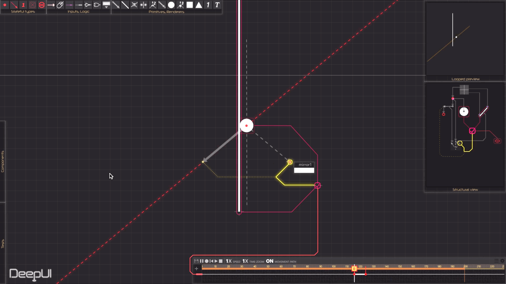

# [DeepUI](https://www.youtube.com/watch?v=Gy5m091fOTU)
by [Arnold Lágler](https://twitter.com/DeepUINews)

Inspired by [Bret Victor's Drawing Dynamic Visualizations](reflections.md#bret-victor). The developer made a rough prototype (unreleased) and a concept video (shown on the website), but then wasn't able to continue working any further on this project, sadly. They suggested to me that they believe [Luna](#luna) to be more promising direction because it's more generic and not restricted to the domain of interactive animations.

    

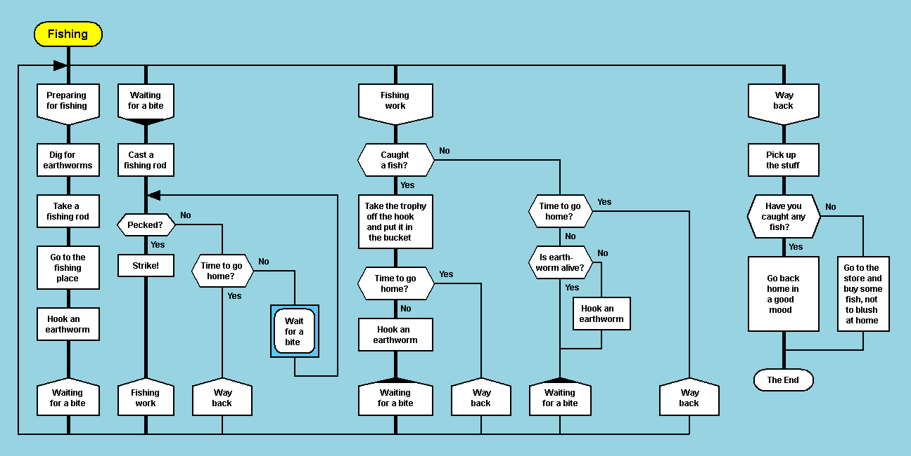

# [DRAKON](http://drakon-editor.sourceforge.net)

> The language provides a uniform way to represent flowcharts of any complexity that are easy to read and understand.

* [Wikipedia](https://en.wikipedia.org/wiki/DRAKON)
* [HN Discussion](https://news.ycombinator.com/item?id=10100932)

    

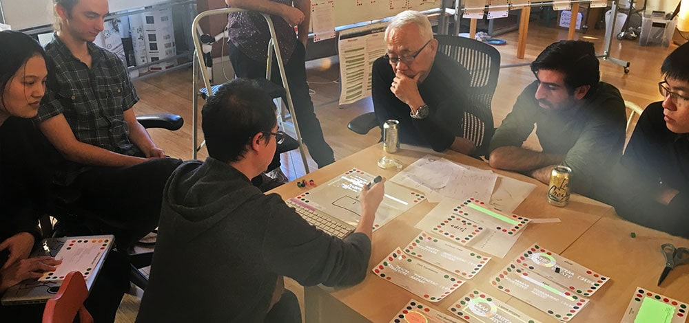

# [Dynamicland](http://dynamicland.org)
by [Bret Victor](http://worrydream.com) (et al.)

Programming wrested away from the screen, rendered into that most immersive and expressive medium: the physical world. If you are reading this and you've never heard of Dynamicland, I insist that you now go learn all you can about it — my codex references nothing else as interesting or exciting as this project.

    

# [Eternal](https://github.com/kousun12/eternal)
by [Rob Cheung](https://www.robcheung.com/)

Fully open source and web based programming enviroment in javascript (React).
> You can think of it as an extension of Sol LeWitt's process art in the sense that it's goal is to decompose art into procedural descriptions. Or you can think of it as an extension of Brian Eno's idea of "music as gardening" in the sense that it gives you a computational garden to tend to.

    

# [Fabrik](http://sp.cmc.msu.ru/courses/smalltalk/fabrik/Fabrik.html)
by [Dan Ingalls](https://en.wikipedia.org/wiki/Dan_Ingalls), Scott Wallace, Yu-Ying Chow, Frank Ludolph, and Ken Doyle at the [Apple ATG](https://en.wikipedia.org/wiki/Apple_Advanced_Technology_Group)

An interesting and fairly early visual language, built in Smalltalk by one of Smalltalk's creators. Also interesting to consider that this work was being done coincidently with HyperCard at Apple.

> Fabrik is a visual programming environment — a kit of computational and user-interface components that can be "wired" together to build new components and useful applications. Fabrik diagrams utilize bidirectional dataflow connections as a shorthand for multiple paths of flow. Built on object-oriented foundations, Fabrik components can compute arbitrary objects as outputs. Music and animation can be programmed in this way and the user interface can even be extended by generating graphical structures that depend on other data. An interactive type system guards against meaningless connections. As with simple dataflow, each Fabrik component can be compiled into an object with access methods corresponding to each of the possible paths of data propagation.

* [Wikipedia](https://en.wikipedia.org/wiki/Fabrik_(software))
* [HN Discussion](https://news.ycombinator.com/item?id=12104463)

    

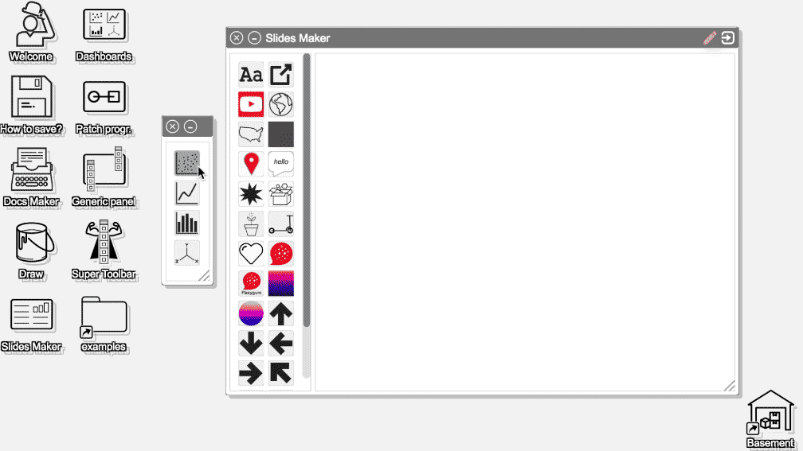

# [Fizzygum](http://fizzygum.org)
by [Davide Della Casa](http://davidedc.com)

A new SmallTalk/HyperCard-like tool

    

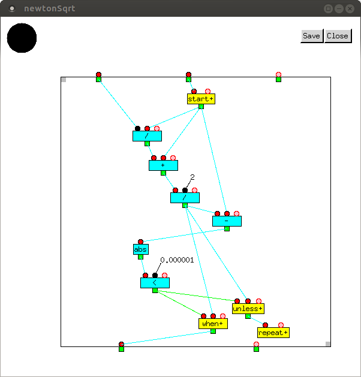

# [Full Metal Jacket](http://www.fmjlang.co.uk/fmj/FMJ.html)
by Donald Fisk

There are some interesting ideas about state and control flow in this one. It's the product of a formal academic process, being written up in a few papers, so there's definitely more thought put into it than might appear judging just by the visual design. It's also newer than you might think — circa 2015.

> Iteration uses two special linked vertices called start+ and repeat+. The start+ vertex has an equal number of inputs and outputs. When a value is received on every input of start+, each value is output on the corresponding output. The repeat+ vertex has the same number of inputs as start+, each of which has the same type. An edge connected to an input on repeat+ really sends its values to the corresponding input on start+.

    

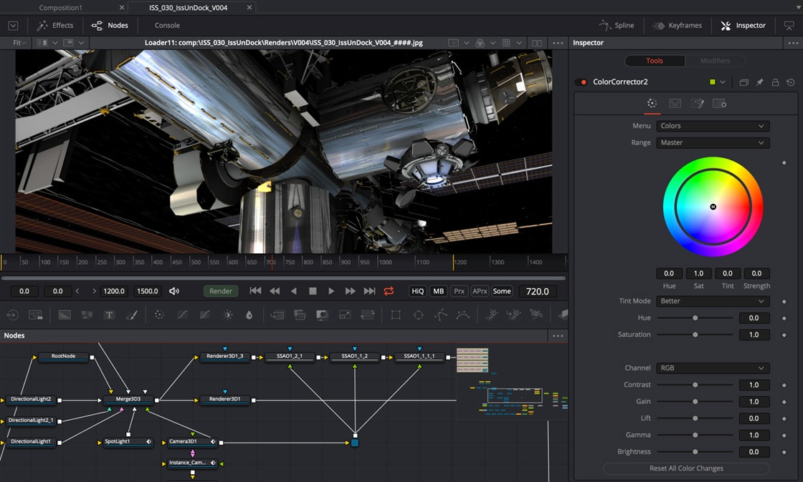

# [Fusion](https://www.blackmagicdesign.com/products/fusion/)
by [Blackmagic](https://www.blackmagicdesign.com/)

A commercial node-based video compositing software for visual effects, concurrent of Adobe After Effects and Foundry's Nuke.

    

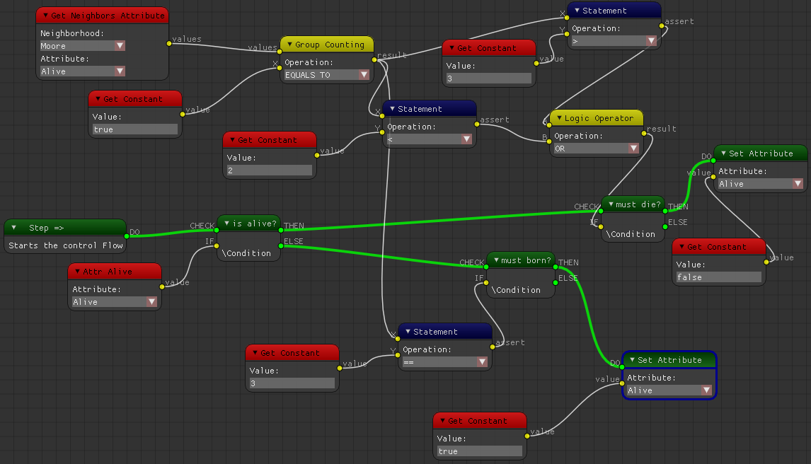

# [Genesis](https://github.com/rff255/Genesis)
by Rodrigo F. Figueiredo

> IDE for modeling and simulation of Cellular Automata

    

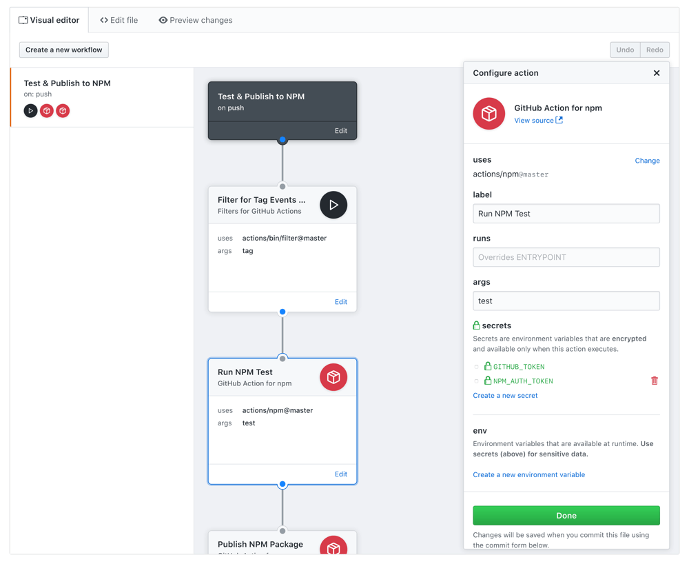

# [Github Actions](https://github.com/features/actions)

A tool for configuring workflows triggered by Github repo events.

    

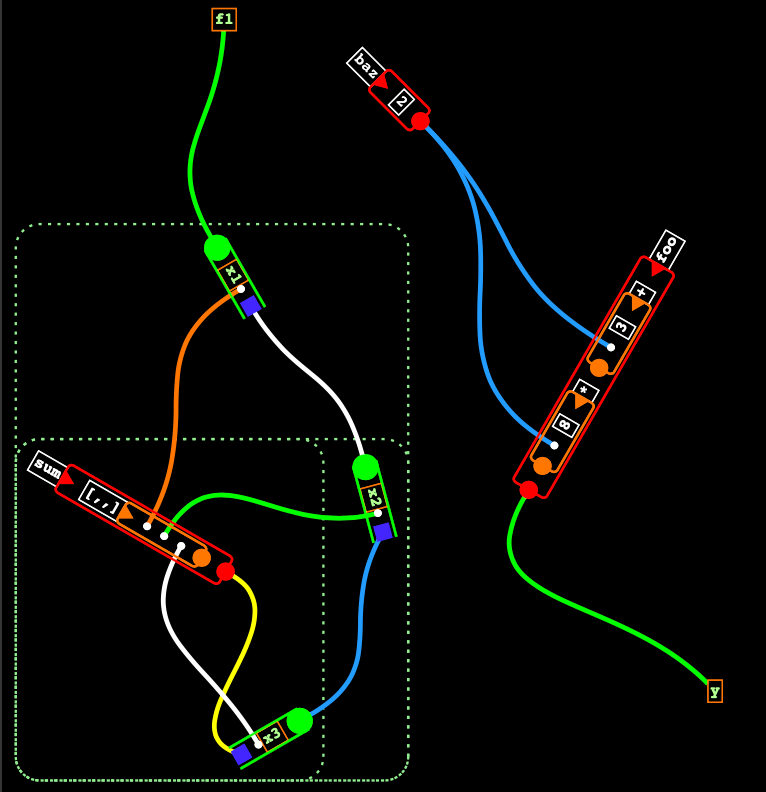

# [Glance](https://github.com/rgleichman/glance)
by Robbie Gleichman

> Currently, the Glance executable produces a visual representation of your code in the form of an SVG image when given a textual Haskell source file.

* This tool has a particularly neat rendering style. I recommend taking a look at [Advantages of Glance](https://github.com/rgleichman/glance/wiki/Advantages-of-Glance) for examples.
* The [Related Work](https://github.com/rgleichman/glance/wiki/Related-work) page has some good links.
* Robbie recently posted [a talk](https://www.youtube.com/watch?v=cb25Ts4rLXA) discussing the design of a new, more compact syntax for Glance. Feedback should be shared in [the Future of Programming](https://futureofcoding.slack.com/archives/CCL5VVBAN/p1576657342007300) Slack community.

    

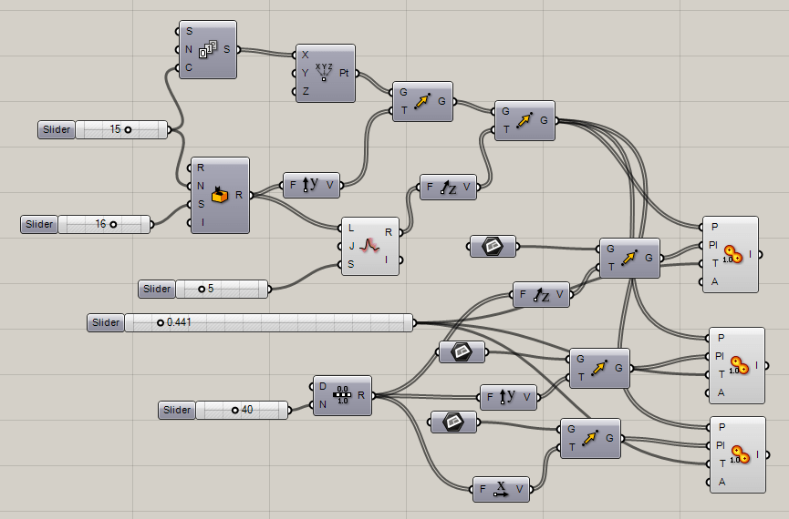

# [Grasshopper](http://www.grasshopper3d.com)

A VPL for procedural modelling in Rhino. It's neat that it uses little icons for nodes instead of names.

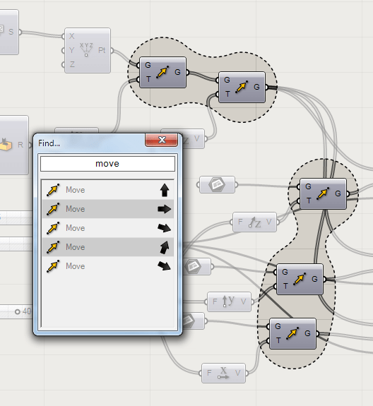

Grasshopper has a neat way of rendering the results of a "find" operation.

    

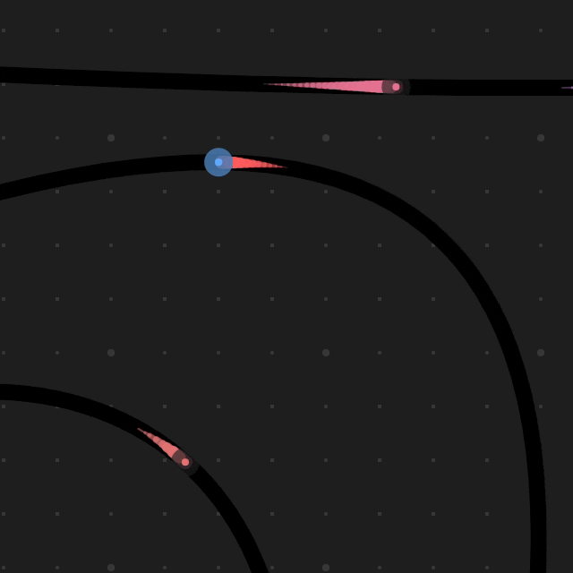

# [Hest](https://twitter.com/spiralganglion/status/1145028588715950080)
by [Ivan Reese](http://spiralganglion.com) for [LunchBox Sessions](https://www.lunchboxsessions.com)

> A drawing tool with visual programming features, currently in private development. Hest is designed to allow the programmer to actively participate in the execution of their code, seeing data flow from function to function, interacting with the data like a video game.

I created this codex to help me do research for Hest. I'm including it here in the hope that some readers may find it interesting or useful as a reference for their own work.

    

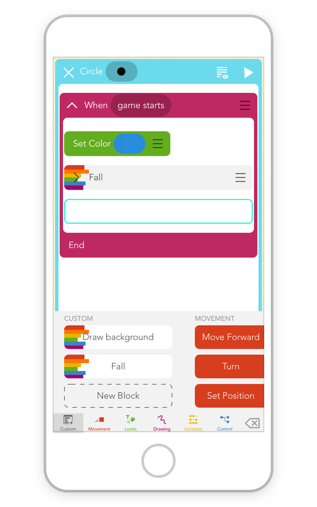

# [Hopscotch](https://www.gethopscotch.com)
by Hopscotch Technologies — Jocelyn Leavitt, Samantha John, Ana Handley, Rodrigo Tello, and Nazarí González

An iPhone/iPad app, heavily inspired by [Scratch](#scratch), with a focus on introducing children to programming by having them make games.

* [Wikipedia](https://en.wikipedia.org/wiki/Hopscotch_(programming_language))
* Samantha John was a guest on [Episode 5](https://futureofcoding.org/episodes/005) of the [Future of Coding](https://futureofcoding.org/) podcast.

    

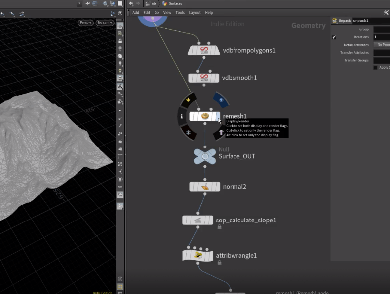

# [Houdini](https://en.wikipedia.org/wiki/Houdini_(software))
by [SideFX](https://www.sidefx.com)

A suite of 3d modelling and visual effects tools, with a number of different VPLs serving various uses.

    

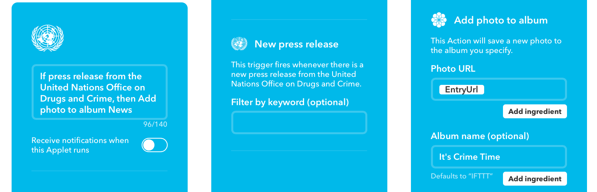

# [IFTTT](https://ifttt.com)

A popular, basic tool for connecting and automating a handful of apps, services, and APIs. The name is short for _If This Then That_.

[Wikipedia](https://en.wikipedia.org/wiki/IFTTT)

    

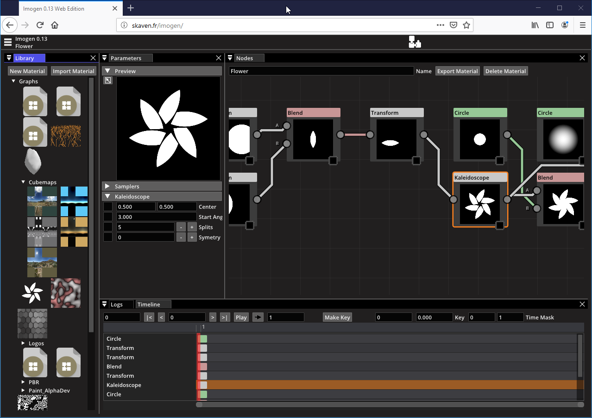

# [Imogen](https://github.com/CedricGuillemet/Imogen)
by [Cedric Guillemet](https://twitter.com/skaven_)

A GPU/CPU Texture Generator using visual programming, available online: http://skaven.fr/imogen/

    

# [Interstate](http://interstate.from.so)

A language+environment designed to show interactive behaviour with more clarity, using state machines and constraints.

Includes: A live updating preview of the running program, a table view with current variable values, a schematic-like view of the state machine with animated transitions and current state highlighting, and highlighting of related elements across representations.

[Demo Video](https://www.youtube.com/watch?v=M--9jsuDZis)

    

# [Joy.js](http://ncase.me/joy/demo/turtle/) by [Nicky Case](https://twitter.com/ncasenmare)

A live programming environment with *excellent* use of visual interactivity. For example, by gradually moving your mouse down the number bullets that mark each (imperative) step of the program, you see that step's execution gradually take place.

    

# LabVIEW

A visual programming language predominantly used in automation, test and data science applications. Each [LabVIEW](https://en.wikipedia.org/wiki/LabVIEW) program is referred to as a Virtual Instrument (VI) which consists of two components; a Front Panel and a Block Diagram. The Front Panel represents both the Graphical User Interface and I/O terminals for the software, whereas the Block Diagram uses the concept of [dataflow](https://en.wikipedia.org/wiki/G_programming_language) to manage the propogation of data around nodes of execution.

    

# [Lire](https://github.com/honix/Lire)

"Lire is a Lisp expressions visual editor, it allows you to write programs using kind of abstract syntax tree (AST). It runs on top of Common Lisp."

The layout of nodes is quite distinct — it feels more like a transit map (or [Mini Metro](inspirations.md#mini-metro)) than most patcher VPLs.

    

# [Litegraph.js](https://github.com/jagenjo/litegraph.js)

"A graph node engine and editor written in Javascript similar to [PD](#pure-data) or [UDK Blueprints](#blueprint), comes with its own editor in HTML5 Canvas2D. The engine can run client side or server side using Node. It allows to export graphs as JSONs to be included in applications independently."

Handy list of [projects using Litegraph](https://github.com/jagenjo/litegraph.js#projects-using-it)

    

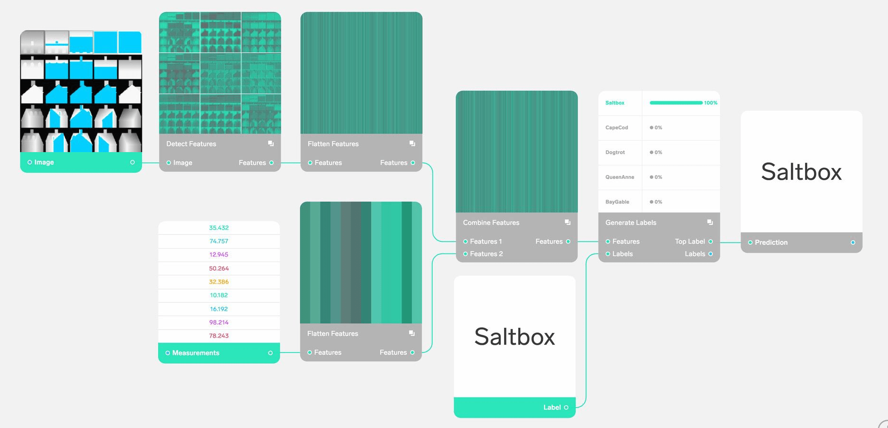

# [Lobe](https://lobe.ai)
by [Mike Matas](https://en.wikipedia.org/wiki/Mike_Matas), [Jaron Lanier](https://en.wikipedia.org/wiki/Jaron_Lanier), et al. Now owned by Microsoft.
> Build, train, and ship custom deep learning models using a simple visual interface.

    

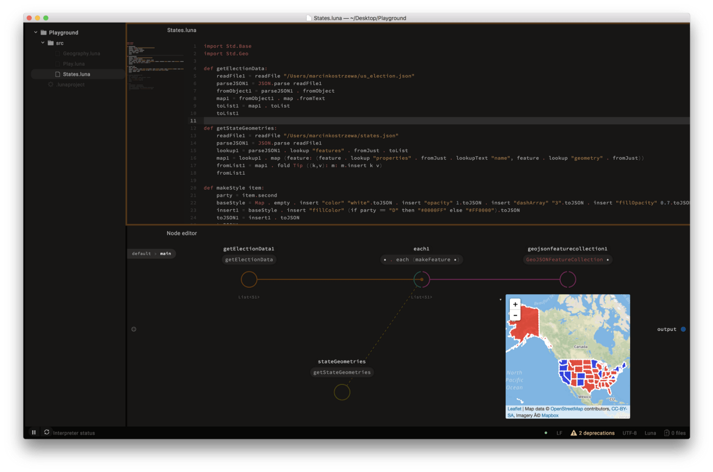

# [Luna](http://www.luna-lang.org)

A VPL with a simultaneous textual/visual view of the program. Recently rebooted as [Enso](https://twitter.com/enso_org).

Subreddit: [LunaLang](https://www.reddit.com/r/LunaLang/)

Video: [Wojciech Daniło & Marcin Kostrzewa Luna - Purely functional paradigm meets visual programming](https://www.youtube.com/watch?v=DhR6XWUBsvg)

Medium post: [Luna, the visual way to create software](https://medium.com/@luna_language/luna-the-visual-way-to-create-software-c4db520d6d1e)

HN: [Luna – Visual and textual functional programming language](https://news.ycombinator.com/item?id=14612680)

HN: [Luna 1.0 Beta is out](https://news.ycombinator.com/item?id=16163769)

    

# [Lynx](https://lynxtool.com)

A work-in-progress visual language with an emphasis on approachability. Looking at their [What](https://lynxtool.com/doc/What.html) page is worthwhile, as they have a handful of UI ideas that I've not seen elsewhere, and many twists on typical UI ideas to make them nicer than the norm.

    

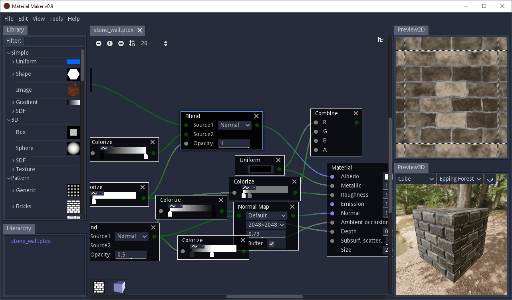

# [Material Maker](https://rodzilla.itch.io/material-maker)
by [Rodolphe Suescun](https://github.com/RodZill4)

> This is a tool based on Godot Engine that can be used to create textures procedurally.
> Its user interface is based on Godot's GraphEdit node: textures are described as interconnected nodes.

    

# [Max/MSP](https://cycling74.com/products/max)

A commercial VPL for musicians and artists, evolved out of [Pure Data](#pure-data).

Likely one of the most famous visual programming languages, widely used for more than 20 years.

    

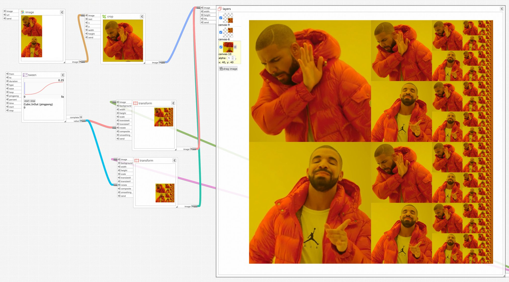

# [Meemoo](https://meemoo.org)
by [Forrest Oliphant](https://www.forresto.com)

A web-based tool for building interactive audio/visual projects.

Designed to encourage hacking and modding, like [circuit bending](https://en.wikipedia.org/wiki/Circuit_bending) but for software. For instance, you can edit the "meta drake" shown above [here](https://app.meemoo.org/#gist/8b234cbbfb2132b329fd45b82be90b0e). (Be sure to click the "start" button in the tween node.)

[Paper](https://meemoo.org/files/ForrestOliphant-MeemooThesis-web.pdf)

    

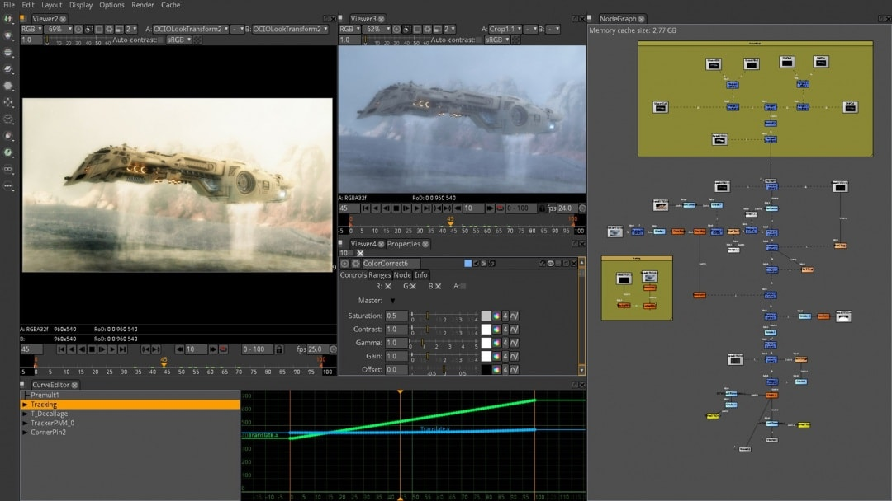

# [Natron](https://github.com/NatronGitHub/Natron)

An open source node-based video compositing software for visual effects, heavily inspired by Foundry's Nuke.

    

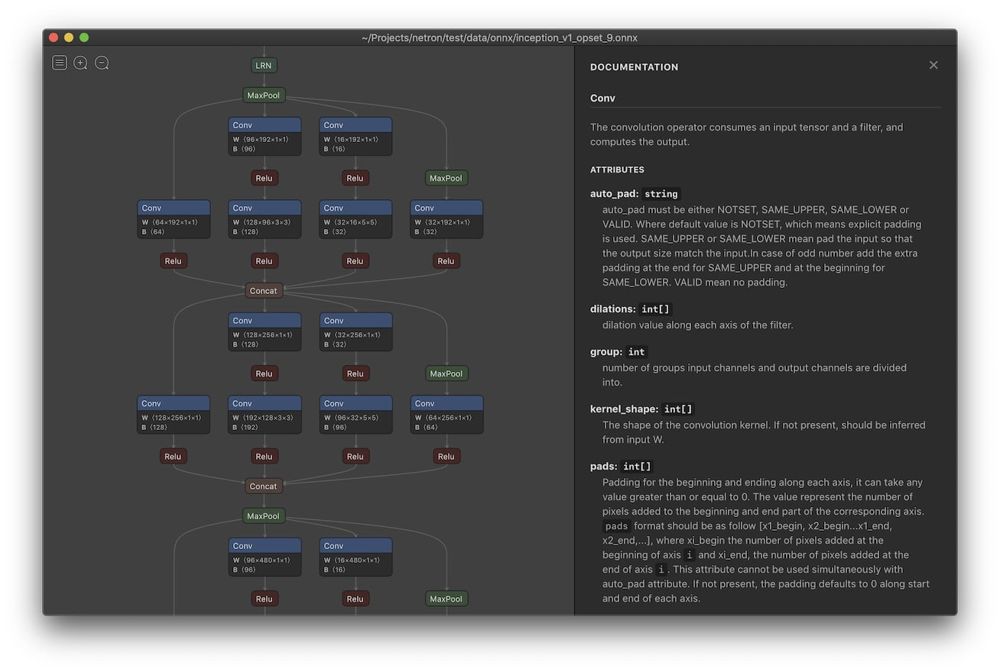

# [Netron](https://github.com/lutzroeder/netron)
by [Lutz Roeder](https://www.lutzroeder.com)

> Visualizer for neural network, deep learning and machine learning models

    

# [Node-RED](https://nodered.org)

"A programming tool for wiring together hardware devices, APIs and online services in new and interesting ways. It provides a browser-based editor that makes it easy to wire together flows using the wide range of nodes in the palette that can be deployed to its runtime in a single-click."

    

# [NodeBox](https://www.nodebox.net)

A dataflow environment created by the [Experimental Media Research Group](https://www.emrg.be) for datavis, generative design, and animations.

    

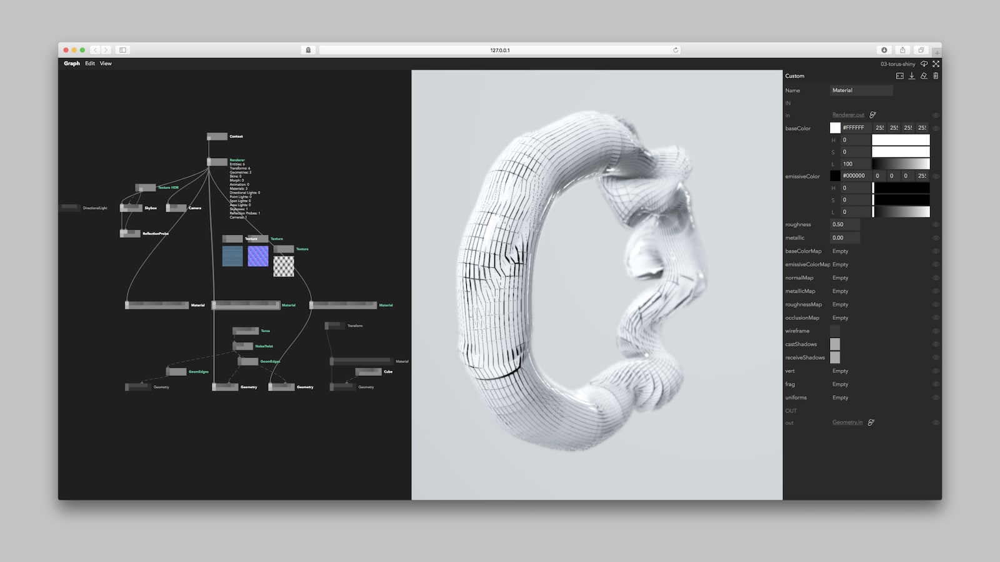

# [Nodes](http://nodes.io)
by [Variable](http://variable.io)

> Nodes is your thinking space for exploring ideas with code on the web, powered by JavaScript and NPM.
> What if programming was about ideas not semicolons? Compose, abstract, generalise. Start from top down or bottom up and refine as you go. With Nodes programming feels like sketching on canvas. Zoom in and out of problems, experiment on the side and easily re-use parts of other projects.

* They've written a fantastic [blog post](http://nodes.io/story/#how-do-i-get-nodes) introducing the project and contextualizing it relative to similar tools.

 

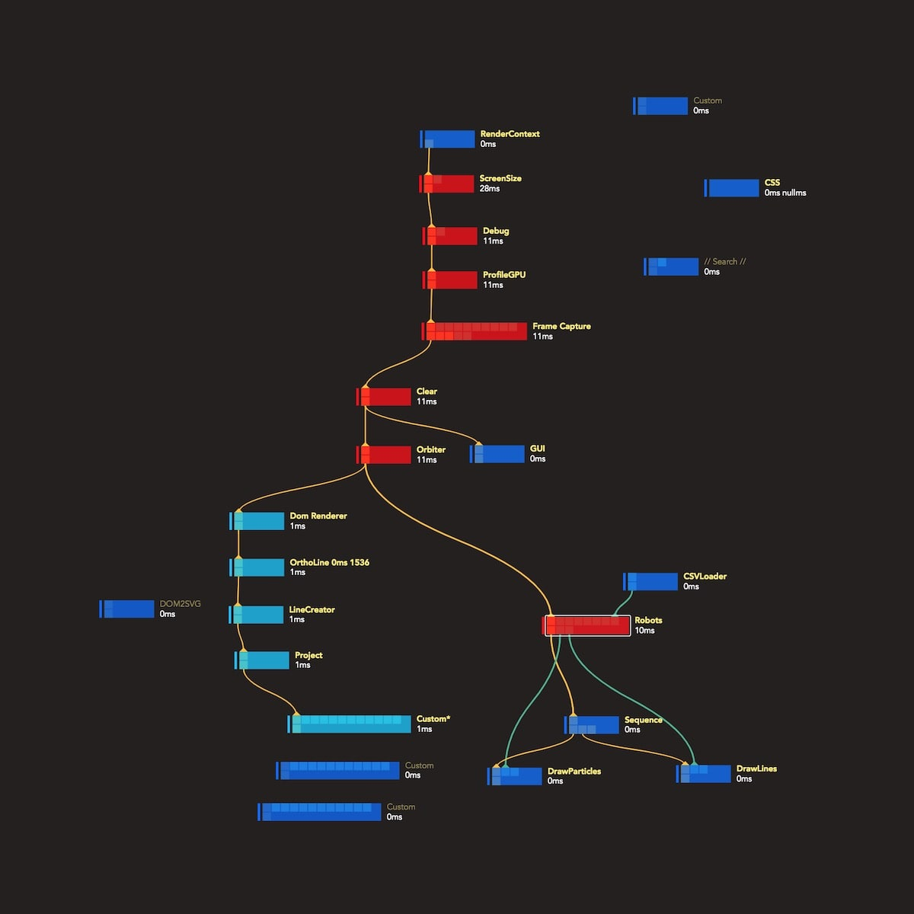

There are a lot of nice features. One, shown above, is a profiler that colors nodes based on the amount of CPU they burn each frame.

    

# [NoFlo](https://noflojs.org)

A flow-based programming environment for JavaScript, targeting the web and Node.js.

Related projects: [Flowhub](app.flowhub.io), [noflo-ui](https://github.com/noflo/noflo-ui)

    

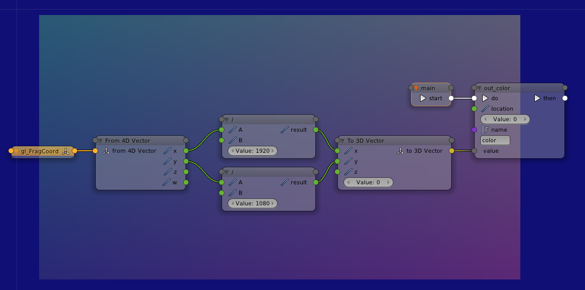

# [Noodles](https://blog.duangle.com/2015/01/conspire-programming-environment-for.html)
by [Duangle](https://twitter.com/duangle)

A prototype VPL created for scripting in a game project. It's interesting how they found working in it felt unproductive, so they switched to a structured editor and a Lisp.

    

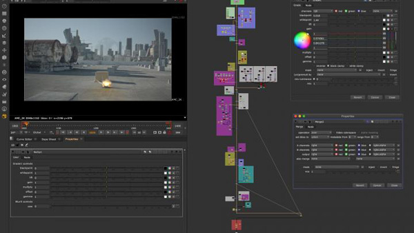

# [Nuke](https://www.foundry.com/products/nuke)
by [Foundry](https://www.foundry.com)

A commercial node-based video compositing software for visual effects, concurrent of Adobe After Effects and Blackmagic Fusion.

    

# [OpenPonk](https://modeling-languages.com/openponk-metamodeling-platform/)

A meta-modelling tool built on top of [Pharo](https://pharo.org/) (a SmallTalk dialect), used to experiment with the creation of modelling tools.

    

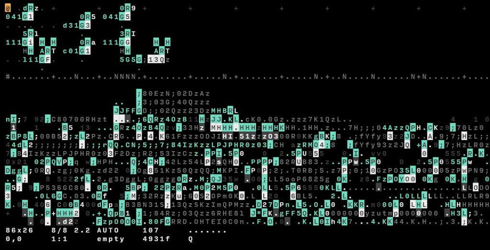

# [ORCΛ](https://wiki.xxiivv.com/#orca)
by [Devine Lu Linvega](https://xxiivv.com)

> Orca is a visual programming playground. Orca is an esoteric programming language, designed to create procedural sequencers. Each letter of the alphabet is an operation, uppercase letters operate each frame, lowercase letters operate on bang.

If you haven't seen it in action, you might think that Orca doesn't really qualify as a visual language. Well, Orca uses text the same way classic roguelike games do — think ADOM or Dwarf Fortress. Each letter of the alphabet represents a function, with inputs on either side and output coming out the bottom. You pass data between functions by arranging them spatially on the grid. Your state is visible as numbers and letters on the grid, too. The fact that letters are used to represent both functions and data means there's a decent amount of metaprogramming easily within reach. In fact, Orca sits at an interesting space between "programming language" and "music sequencer", making the programming experience feel a lot like improvising and exploring on a musical instrument. Very cool.

Orca doesn't generate any sound on its own. It's not even a tool for music until you hook it up to (eg) a synthesizer. But you could also hook it up to something else, like a game engine, and use it to drive game logic or graphics.

* [Example 1](https://twitter.com/neauoire/status/1135510882807500800)
* [Example 2](https://twitter.com/neauoire/status/1149853206018584576)
* [ORCA Sequencer Intro](https://www.youtube.com/watch?v=RaI_TuISSJE&t=839) — This is a nice introductory tutorial. I've linked to a spot in the video that should give you a taste of the spatial nature of Orca.

I wonder what would happen if someone fed the output of a cellular automaton into Orca, or used it as part of a roguelike.

    

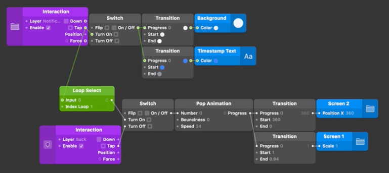

# [Origami](https://origami.design)
By Facebook

A prototyping tool originally built atop [Quartz Composer](#quartz-composer), but more recently rebuilt as a standalone (albeit less capable) app.

* Used to prototype the UI/UX of their Paper app.

* I've found that it offers a few interesting tweaks on the common nodes-based VPL format, though with a raft of apparent shortcomings. You can read more of my impressions [here](impressions/origami.md).

    

# PA3D

[Video demo](https://www.youtube.com/watch?v=5JzaEUJ7IbE) — "PAD3D was a very early (about 1993) zoomable user interface implemented on an SGI in Lisp using accelerated 3D graphics.  This demo shows zooming, authoring, text, images, dynamic fisheye of source code, live visual bookmarks, and a nested zooming file browser."

    

# [Parabola](https://parabola.io)

A simple VPL for automating tasks, similar to [IFTTT](#ifttt).

[HN Discussion](https://news.ycombinator.com/item?id=17147272)

    

# [Patternodes](https://www.lostminds.com/patternodes2/)

A nice-looking VPL for creating repeating pattern graphics

Includes features for creating animated patterns

    

# [Piet](http://www.dangermouse.net/esoteric/piet.html)

"Piet is a programming language in which programs look like abstract paintings."

[Example programs](http://www.dangermouse.net/esoteric/piet/samples.html)

    

# PIM — Programming In the Model

Research project by Myriam Maleki

A visual scripting interface for parametric CAD

Echoes some of the ideas in Bret Victor's Learnable Programming and Drawing Dynamic Visualizations

[Demo View](https://www.youtube.com/watch?v=U59Lr7WvEOo) (seemingly contains no sound — bummer)

[Overview](http://papers.cumincad.org/data/works/att/acadia13_191.content.pdf)

[Paper](http://clab.iat.sfu.ca/pubs/Maleki-PIM-DIS.pdf)

    

# [PraxisLive](https://www.praxislive.org)

A visual IDE for creative coding, focussing on realtime audio and video (OpenGL).

On [Twitter](https://twitter.com/PraxisLIVE)

    

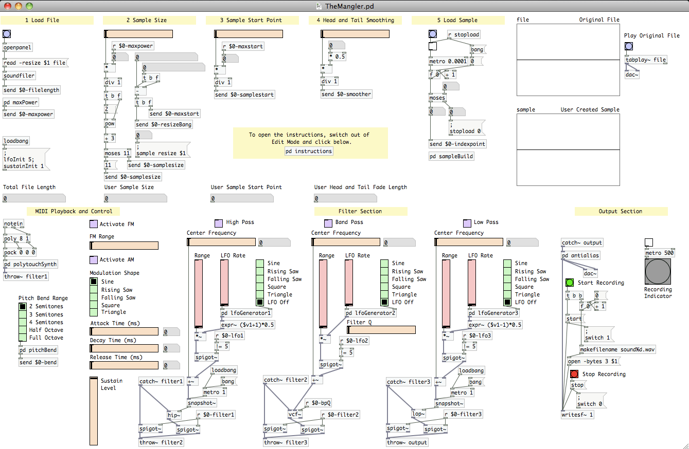

# [Pure Data](https://puredata.info)

[Wikipedia](https://en.wikipedia.org/wiki/Pure_Data)

An open source VPL for musicians and artists. Pure Data (Pd) is the prototypical example of a VPL — boxes that direct or transform flowing data, connected together with lines through which the data flows. Pd has distinctly-styled lines for messages (strings) and for signals (audio data), and type-specific "objects" (boxes) like `sin` for messages and `sin~` for signals.

The help and tutorial documents are implemented as Pd patches, and you are encouraged to edit them.

    

# [Quartz Composer](https://en.wikipedia.org/wiki/Quartz_Composer)

A discontinued tool from Apple that was useful for creating animations and prototypes, leveraging technologies in macOS like CoreImage.

    

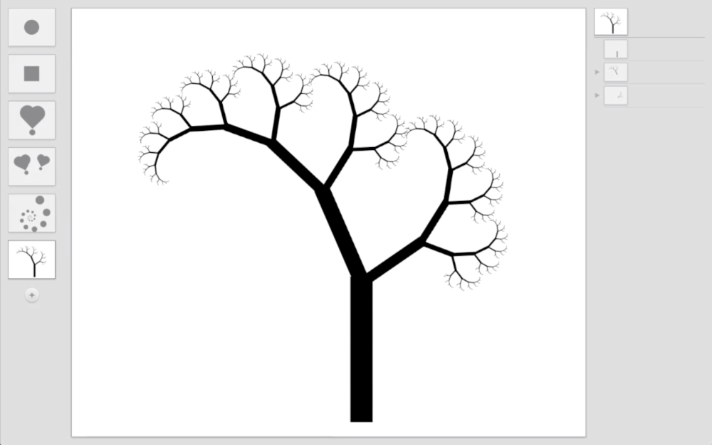

# [Recursive Drawing](http://recursivedrawing.com)
by [Toby Schachman](https://twitter.com/mandy3284)

> Recursive Drawing is an exploration of user interface ideas towards the development of a spatially-oriented programming environment.

Reflected on [here](reflections.md#toby-schachman)

    

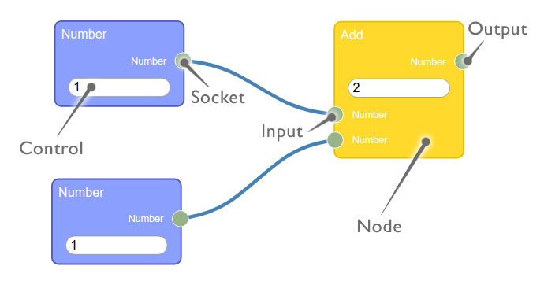

# [Rete](https://github.com/retejs/rete)
by [Vitaliy Stoliarov](https://github.com/Ni55aN)

> Rete is a modular framework for visual programming. Rete allows you to create node-based editor directly in the browser. You can define nodes and workers that allow users to create instructions for processing data in your editor without a single line of code.

This project seems pretty rough, but it's surprisingly popular. There might be something to it that wasn't immediately obvious to me in my initial quick kick of the tires.

    

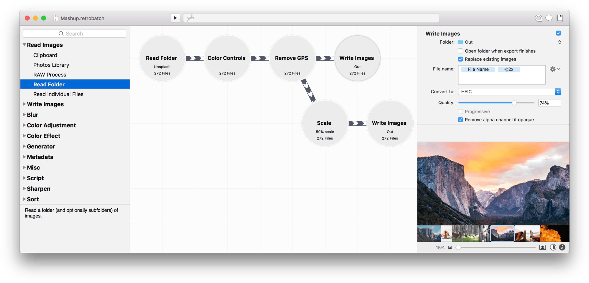

# [Retrobatch](https://flyingmeat.com/retrobatch/)
by [Gus Mueller](https://twitter.com/ccgus) at [Flying Meat](https://flyingmeat.com)

> Flexible, super charged, batch image processing for your Mac. A node based batch image processor means you can mix, match, and combine different operations together to make the perfect workflow. A node for every operation, from changing DPI to rotation to Machine Learning to custom behaviors with AppleScript. Optimize your images for fast delivery over the Internet.

    

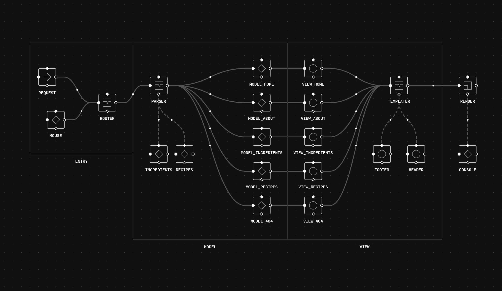

# [Riven](https://wiki.xxiivv.com/#riven)
by [Devine Lu Linvega](https://xxiivv.com)

A flow-based framework for creating websites.

Devine has a striking sense of aesthetics, and Riven is no exception.

You can view (though I don't believe edit) [the Riven program](https://wiki.xxiivv.com/riven.html#home) that configures the server for their website.

    

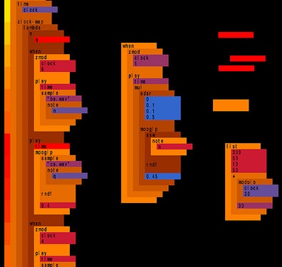

# [Scheme Bricks](http://www.pawfal.org/dave/index.cgi?Projects/Scheme%20Bricks)
by [Dave Griffiths](http://www.pawfal.org/dave/) [[Twitter](https://twitter.com/nebogeo)]

> A way to livecode scheme visually, by plugging in and tearing off bits of code.

    

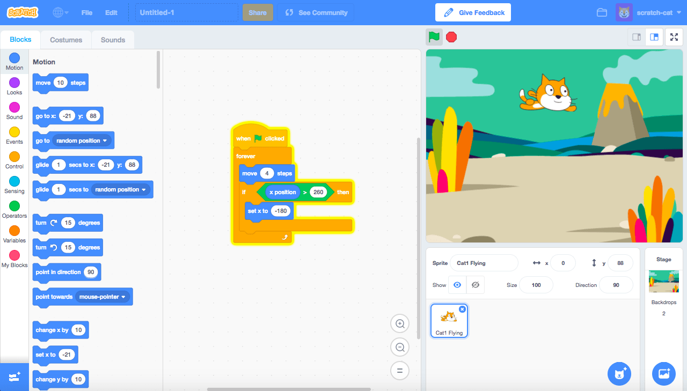

# [Scratch](https://en.wikipedia.org/wiki/Scratch_(programming_language))

A VPL designed mainly for children. Scratch is a text-centric language that you assemble using blocks that snap together, with the syntax rules enforced by the shape of the blocks. Color is used to indicate a block's type of data or behaviour.

* [Scratch 3.0](https://llk.github.io/scratch-gui/), which runs in the browser

    

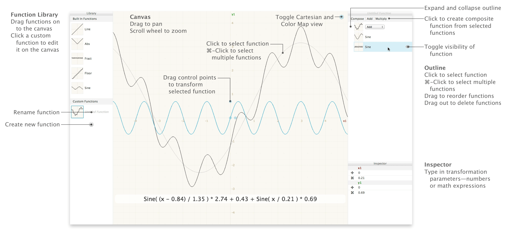

# [Shadershop](http://tobyschachman.com/Shadershop/)
By [Toby Schachman](https://twitter.com/mandy3284)

> Shadershop is an interface for programming GPU shaders in the mode of a direct manipulation image editor like Photoshop. It is an experiment in leveraging the programmer's spatial reasoning the way that coding today leverages the programmer's symbolic reasoning.

    

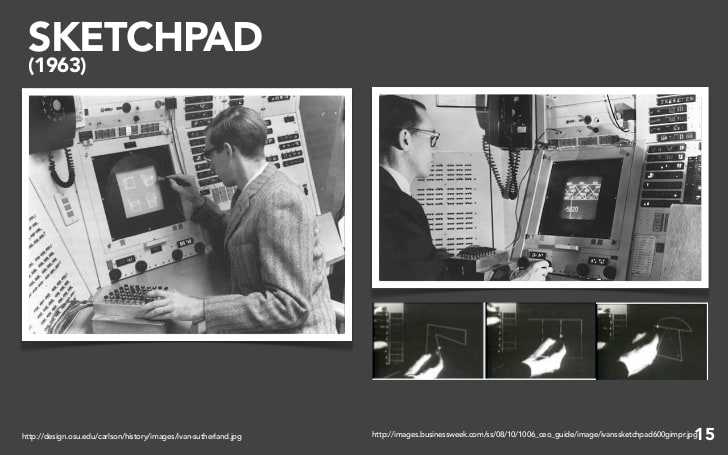

# [Sketchpad](https://en.wikipedia.org/wiki/Sketchpad)
by [Ivan Sutherland](https://en.wikipedia.org/wiki/Ivan_Sutherland) in 1963

* One of the first ever GUIs.
* [Demo Video](https://www.youtube.com/watch?v=495nCzxM9PI) with commentary by Alan Kay
* [HN Discussion](https://news.ycombinator.com/item?id=8912137)
* [HN Discussion](https://news.ycombinator.com/item?id=13932586)

    

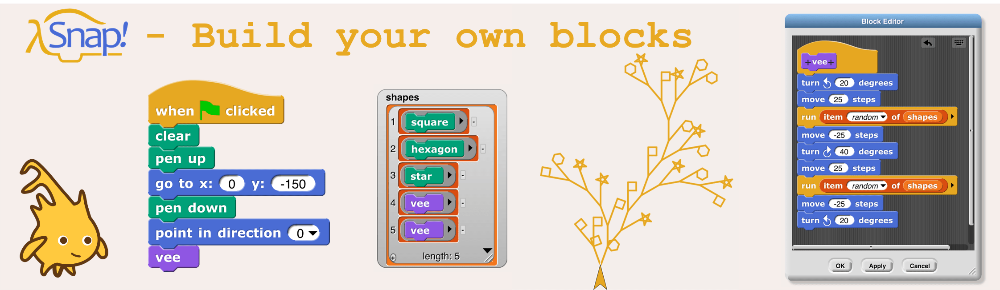

# [Snap!](https://snap.berkeley.edu)

> Snap! is a broadly inviting programming language for kids and adults that's also a platform for serious study of computer science.

A [Scratch](#scratch)-inspired block-snapping VPL with first-class procedures, lists, objects, and continuations.

    

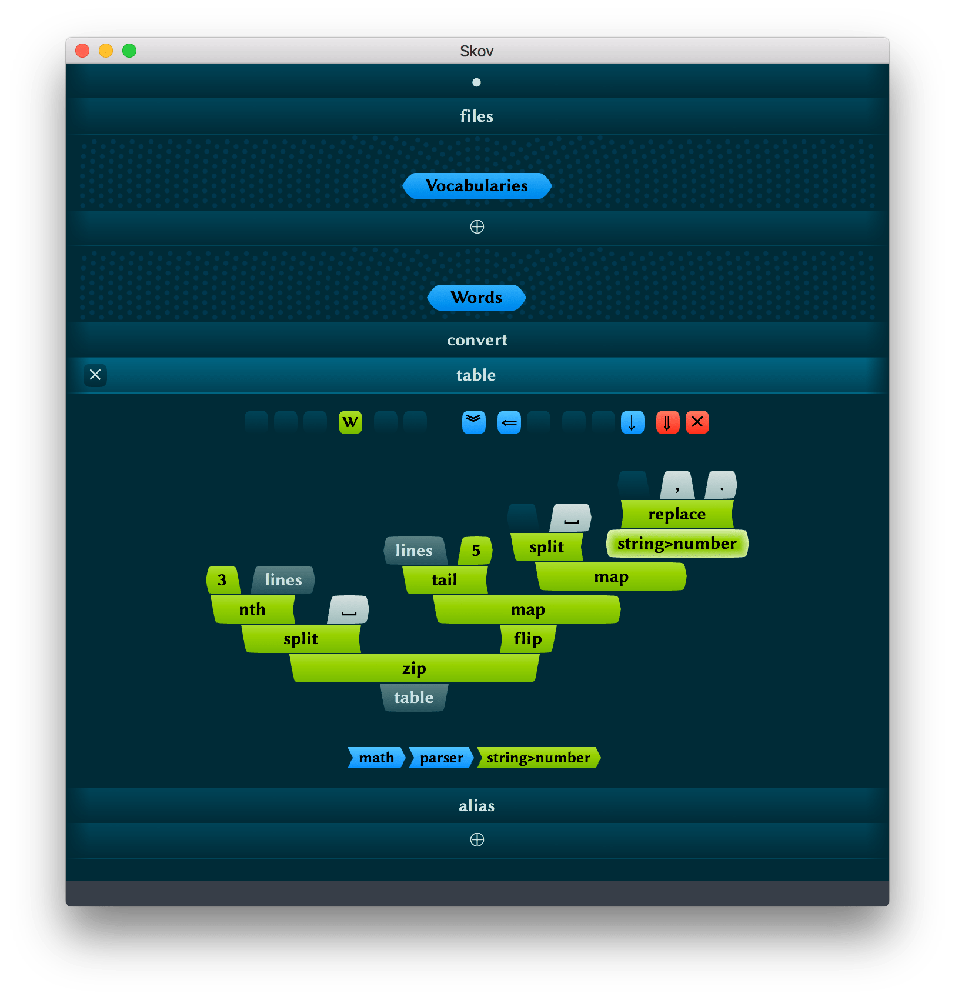

# [Skov](http://skov.software/en/)

A rather neat-looking VPL, vaguely reminiscent of [Scratch](#scratch) (ie. not a patch-based VPL). Very tree-centric. Based on [Factor](https://github.com/factor/factor/).

[Github](https://github.com/nicolas-p/skov)

    

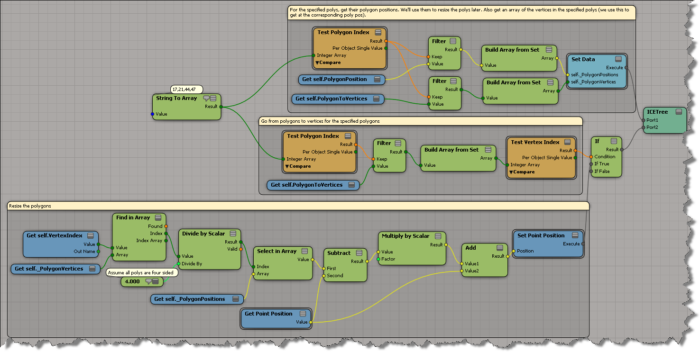

# [Softimage ICE](https://en.wikipedia.org/wiki/Autodesk_Softimage#ICE_Interactive_Creative_Environment)

A node-based VPL for scripting Softimage (RIP). Useful for procedural modelling, deformation, rigging, particle simulation, animation, etc.

    

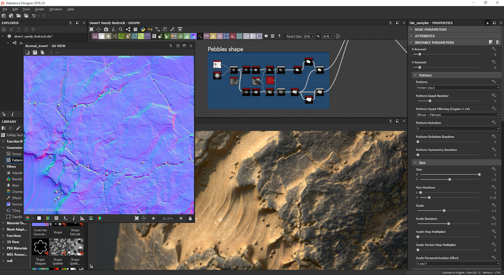

# [Substance Designer](https://www.substance3d.com/products/substance-designer/)
by [Adobe](https://www.adobe.com/)

A commercial node-based editor for generating multi-channel texture images for video games and visual effects.

    

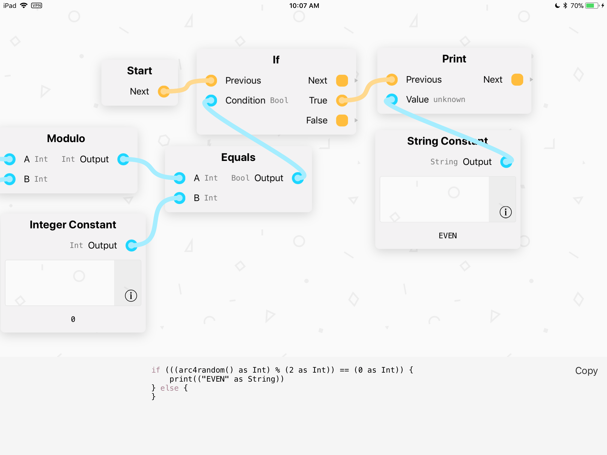

# [Swift VPL](https://github.com/NathanFlurry/VisualProgrammingLanguage)

> Visual programming language written in Swift that assembles to executable Swift code. WWDC '18 scholarship submission. This project aims to proof the node-based visual programming language that assembles executable Swift code and can be written using an Apple Pencil or touch entirely.

A rough prototype that looks modern but doesn't seem particularly fleshed-out. One nice feature is the way nodes are created using the Apple Pencil, which you can see [here](https://www.youtube.com/watch?v=BNWC_OF5Q-Y).

    

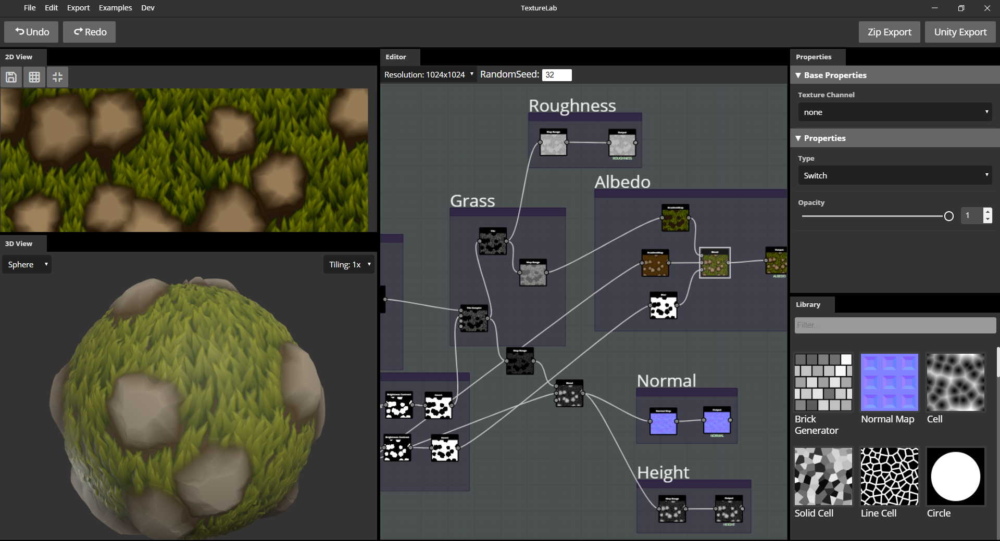

# [TextureLab](https://github.com/njbrown/texturelab)
by [Nicolas Brown](https://nickthecoder.wordpress.com/)

Free, Cross-Platform, GPU-Accelerated Procedural Texture Generator, heavily inpired by Adobe's Substance Designer.

    

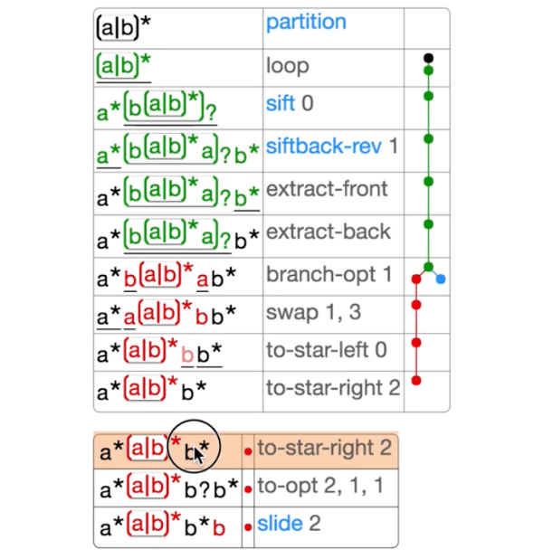

# ThoughtTalk
by [Sean McDirmid](https://twitter.com/seanmcdirmid18)

A neat prototype for directly manipulating abstractions.

* Sean has a number of videos of ThoughtTalk and other prototypes on [his YouTube channel](https://www.youtube.com/user/seanmcdirmid/videos), like [this narrated video](https://www.youtube.com/watch?v=e6ZyswW_0oo) and this [quick demo](https://www.youtube.com/watch?v=4bMjNyqQHfY).

    

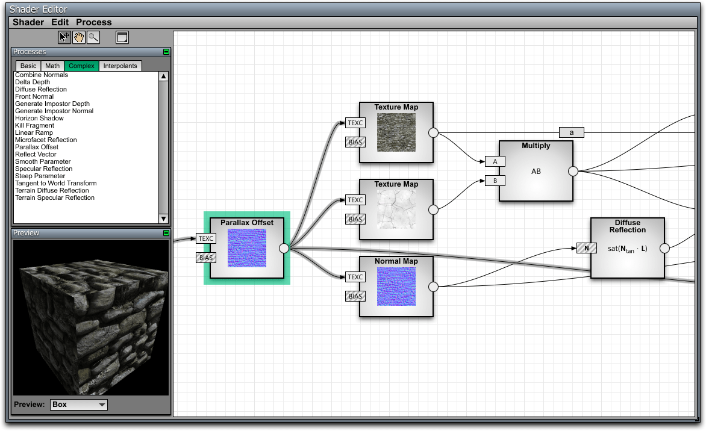

# [Tombstone Engine](http://tombstoneengine.com)
by [Eric Lengyel](http://terathon.com/index.html)

A game engine that includes some VPL editor tools: A [shader editor](http://tombstoneengine.com/wiki/index.php?title=Shader_Editor) and [script editor](http://tombstoneengine.com/wiki/index.php?title=Script_Editor).

    

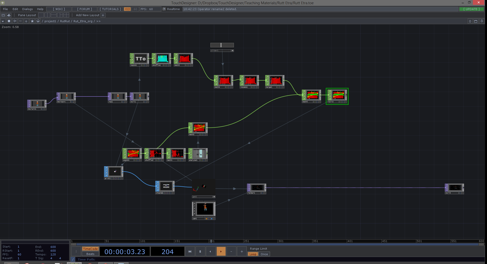

# [TouchDesigner](http://derivative.ca)

Features a node-based programming environment (mainly for multimedia) that is extendable/interoperable with Python

    

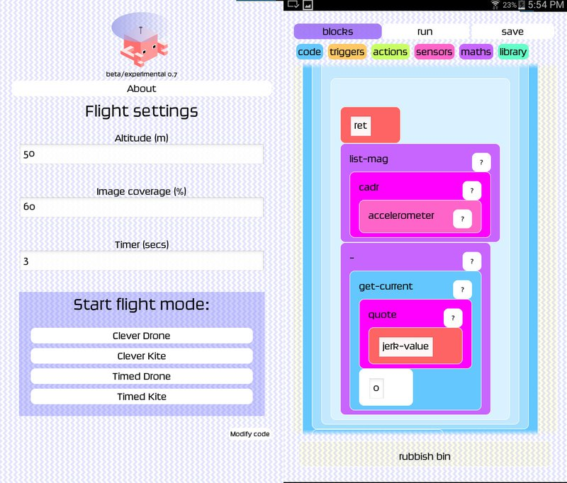

# [UAV Toolkit](https://fo.am/uav-toolkit/)
by Dave Griffiths [[Site](http://www.pawfal.org/dave/)] [[Twitter](https://twitter.com/nebogeo)]

> The UAV toolkit is an [experimental android application](https://play.google.com/store/apps/details?id=foam.uavtoolkit&hl=en) for making use of your smartphone's sensors for airborne science. Its main purpose is using visually programmed time or space based triggers to capture images with associated sensor data for further processing.

    

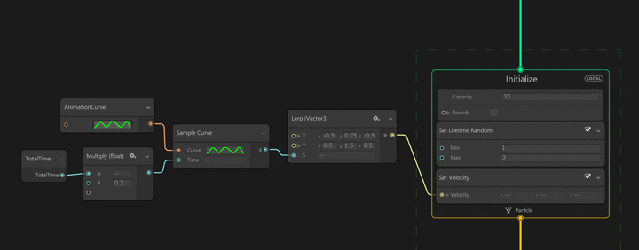

# [Unity Visual Effect Graph](https://unity.com/visual-effect-graph)
by [Unity](https://unity.com)

> A tool for building real-time visual effects in Unity. The tool uses GPU run compute shaders, and a node-based workflow.

* Introductory [Demo Video](https://www.youtube.com/watch?v=SUZzJcBIK80) and [Blog Post](https://blogs.unity3d.com/2018/11/27/creating-explosive-visuals-with-the-visual-effect-graph/)
* Documentation [on Github](https://github.com/Unity-Technologies/ScriptableRenderPipeline/wiki/Visual-Effect-Graph)

    

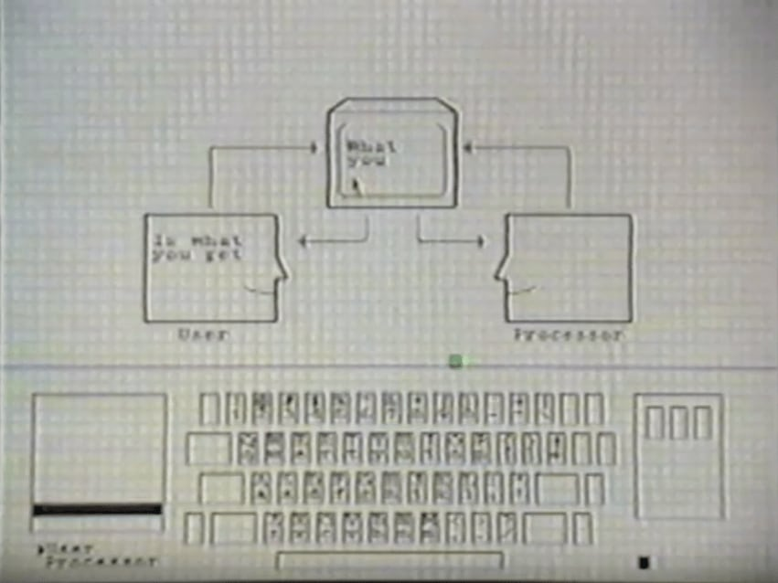

# [Viewpoint](http://www.scottkim.com.previewc40.carrierzone.com/viewpoint/index.html)
by [Scott Kim](http://www.scottkim.com)

> It struck me as odd, and deeply wrong, that we were building tools for visual artists in a programming language that was utterly symbolic, and lacking in visual sophistication. I yearned for a programming language that had the same visual clarity that graphic user interfaces had.

A prototype "pixel editor" programming system where the pixels on the screen hold the full state of the system, created during Kim's internship at Xerox PARC in the early 1980s.

* [Demo Video](https://www.youtube.com/watch?v=9G0r7jL3xl8)
* [Dissertation (PDF)](http://www.scottkim.com.previewc40.carrierzone.com/viewpoint/viewpoint-dissertation.pdf) — There's a brief update from 2013 included near the start, summarizing Kim's more recent thoughts about visual programming and reflecting on what the Viewpoint project was intended to achieve.

    

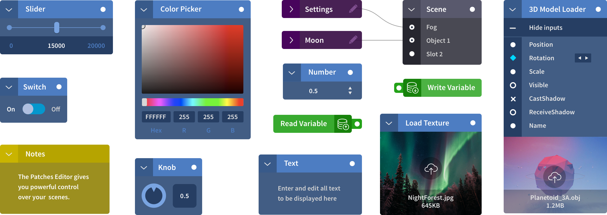

# [Vizor Patches](https://patches.vizor.io)
by [Vizor](https://site.vizor.io)

> Patches is a visual programming editor for building WebVR and WebGL experiences. With over 350 patches, ranging from low level programming, loops, variables and arrays to colour pickers and interaction triggers, Patches is a powerful and flexible modular system for building complex webVR projects. Patches is free to use, released under an MIT licence. It offers a UI to the popular Three.js library.

    

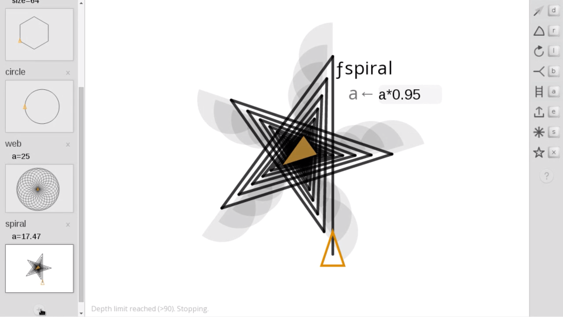

# [Vogo](http://mgrf.de/vogo/)
by [Matthias Graf](http://mgrf.de)

> An experimental [direct manipulation](http://en.wikipedia.org/wiki/Direct_manipulation_interface) interface for [turtle graphics](https://en.wikipedia.org/wiki/Turtle_graphics)

* This isn't a general purpose language, but it is quite neat.
* Be warned that the video on the project page might take a long time to download. You can watch it [on Vimeo](https://vimeo.com/113843398).
* [Nicky Case](#joy-js) made [something similar](https://twitter.com/ncasenmare/status/919219174311911424), leading to a good twitter thread.

    

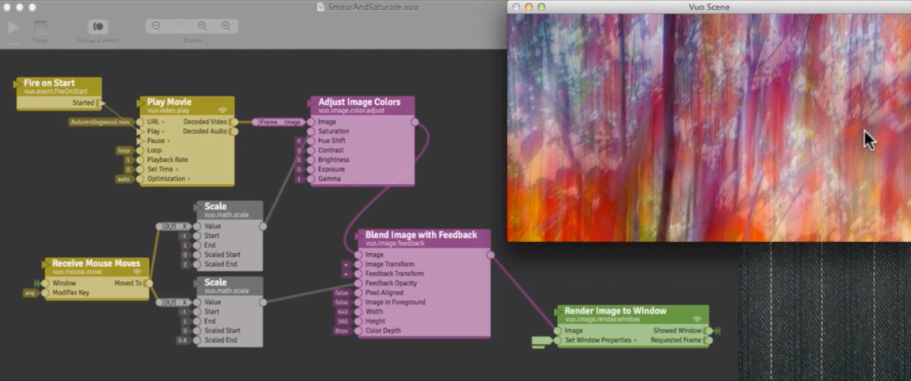

# [Vuo](https://vuo.org)

A high-performance patcher VPL for live VJ-ing, similar to [vvvv](#vvvv), Processing, [Max](#max-msp), and [Quartz Composer](#quartz-composer).

* Here's an interesting page: [How does Vuo compare to other creative coding environments?](https://vuo.org/compare/building) (Be sure to flip through the various tabs)

    

# [vvvv](https://vvvv.org)

> A hybrid visual/textual live-programming environment. It is designed to facilitate the handling of large media environments with physical interfaces, real-time motion graphics, audio and video that can interact with many users simultaneously.

* [Wikipedia](https://en.wikipedia.org/wiki/Vvvv)
* [Creating a Simple Drawing App (with Undo!)](https://vimeo.com/364546032) — a very cool demo that quickly gives you a taste of data types, collections, operators, etc.

    

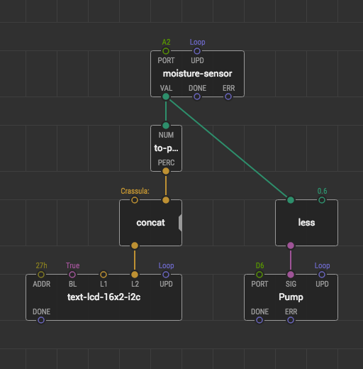

# [XOD](https://xod.io)

A vertical patcher VPL for microcontrollers, with a nice looking grid structure (rows with gutters)

    

# [Zells](http://zells.org)
by [Nikolas Martens](http://rtens.org)

Prototype 5 [demo video](https://www.youtube.com/watch?v=T0fLZ8XceLo): A spatial VPL that uses omnidirectional pulses to convey data and drive execution.
