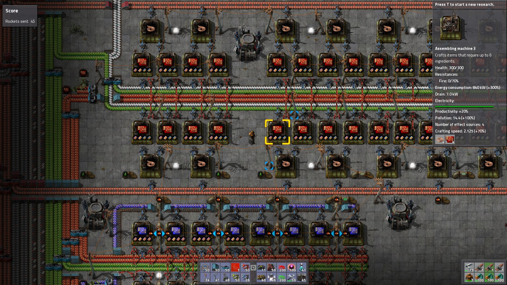
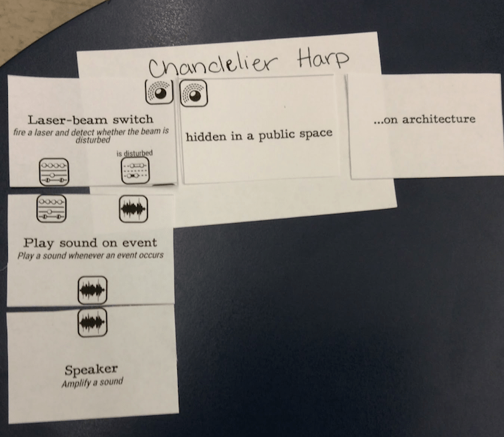
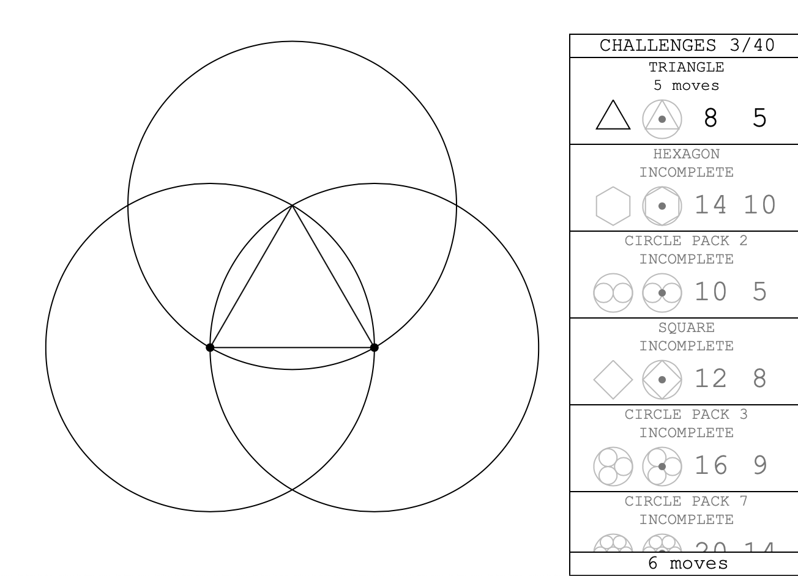
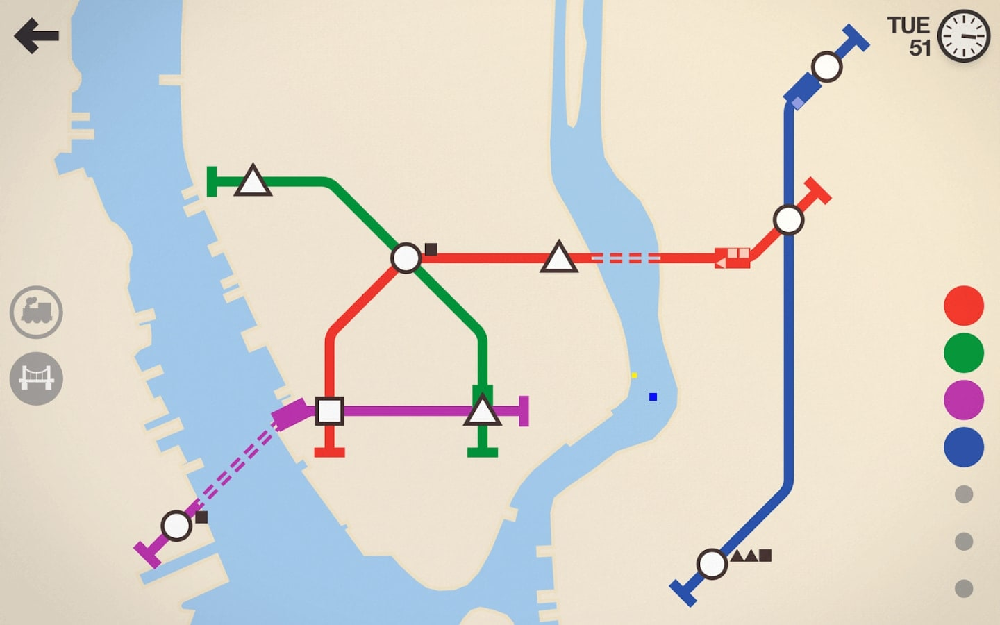
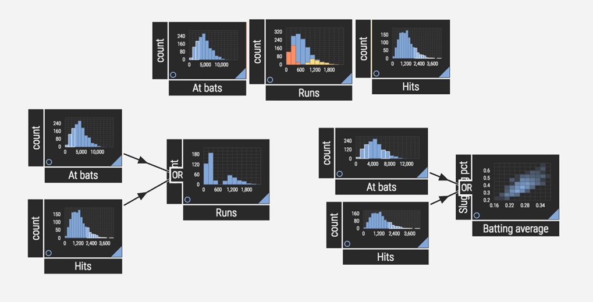
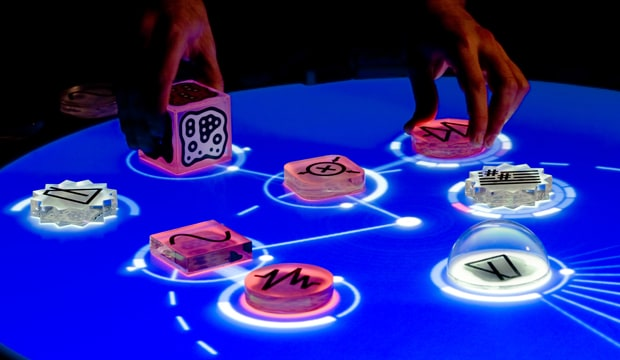
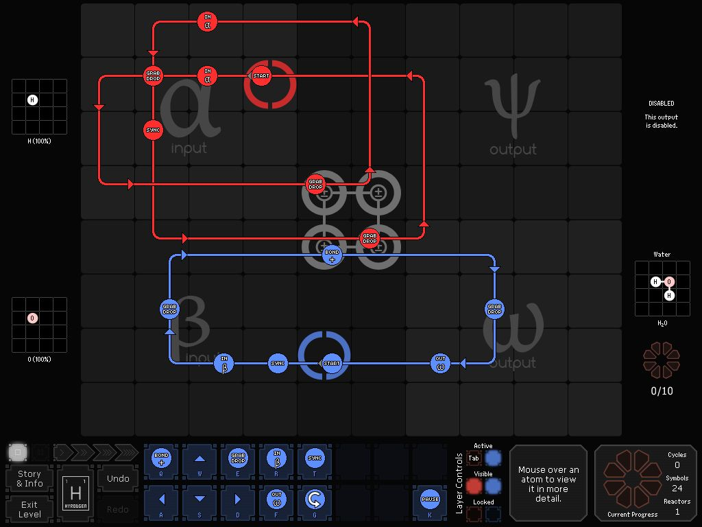

# Factorio

* [Trailer](https://www.youtube.com/watch?v=DR01YdFtWFI)
* In this simulation game, the player builds a sprawling factory system. Raw ores are mined, then travel along conveyors to furnaces, which produce metals. Metals are conveyed to assembling machines, which combine them into different intermediate products (eg: copper -> copper wire, iron + copper wire -> electronic circuit). There are many dozens (perhaps hundreds) of intermediate and final products. The player gradually grows a sophisticated and complex factory system to produce them in the right volumes, at the right rates, directed to the right locations. The factory system is built up of primitives: conveyors, robot arms for loading/uploading, assembling machines.
* This is akin to VPLs in that you have a system of processes, with inputs and outputs and a notion of conveyance. You have transformations of "data" (metals, products). Playing the game involves design, development, and debugging. As you gain skill, you go through many cycles of design-pattern creation and improvement.

    

# [Generominos](http://www.galaxykate.com/generominos/)
by [Kate Compton](https://twitter.com/GalaxyKate)

* A conceptual language for designing generative/interactive art and games.
* A bit like [Oblique Strategies](https://en.wikipedia.org/wiki/Oblique_Strategies)

    

# [Let's Play: Ancient Greek Geometry](https://sciencevsmagic.net/geo/)
by [Nico Disseldorp](https://twitter.com/sciencevsmagic)

* A game about building complex geometric primitives using only points, straight lines between points, and circles around points. Intersections create new points.
* In other words, a game of [Greek geometric algebra](https://en.wikipedia.org/wiki/History_of_algebra#Greek_geometric_algebra) — a form of algebra done entirely with the point/line/circle primitives (and extensions to higher dimensions), which is capable of producing sums, differences, exponents, roots, and more.
* Rudy Rucker gives a wonderful explanation of this in his book Infinity & The Mind, which is free online. Here's the relevant section: [Constructing Reals](http://www.rudyrucker.com/infinityandthemind/#calibre_link-318).
* The [blog post](http://blog.sciencevsmagic.net/science/lets-play-ancient-greek-geometry/) has some discussion of the design decisions.

    

# [Mini Metro](http://dinopoloclub.com/minimetro/)

* A minimalist game where you build a rail transit system. Not related to programming per se, but visually very similar to many patcher-style VPLs. The design language should be of interest to anyone working on patcher VPLs — and besides, it's a [good game](http://www.metacritic.com/game/ios/mini-metro) with [good music](http://designingsound.org/2016/02/18/the-programmed-music-of-mini-metro-interview-with-rich-vreeland-disasterpeace/).

    

# [Northst*r](http://einblick.ai)

* A data science / analysis tool with an interesting drag-and-drop interface. When watching their demo video (warning — it's a pretty large download) I found it fairly confusing and had trouble figuring out what things were, and what dragging them around would do. But it seemed fairly self-consistent, so this is probably just unfamiliarity on my part rather than a design weakness.

    

# [reacTable](http://reactable.com)

* An electronic music instrument with a tangible user interface.
* Superficially similar to [DynamicLand](/implementations.md#dynamicland) in its tangibility, but focussed on a very narrow use case, and not programmable.
* Famously used by Bjork as part of the [Volta](https://en.wikipedia.org/wiki/Volta_(album)) tour.
* [Demo Video](https://www.youtube.com/watch?v=0h-RhyopUmc)
* [Wikipedia](https://en.wikipedia.org/wiki/Reactable)
* Now available as a [mobile app](http://reactable.com/mobile/)

    

# [SpaceChem](http://www.zachtronics.com/spacechem/)
by [Zachtronics](https://twitter.com/zachtronics)

* [Wikipedia](https://en.wikipedia.org/wiki/SpaceChem)
* Has been used in academia to teach concepts related to programming and chemistry.
* This is one of my favourite video games, and a huge inspiration in my own work designing visual programming languages. I highly recommend people buy it (it's cheap), play it (it's fun), and ruminate on it as a possible direction for programming tool design (it comes through with the goods, quickly).
